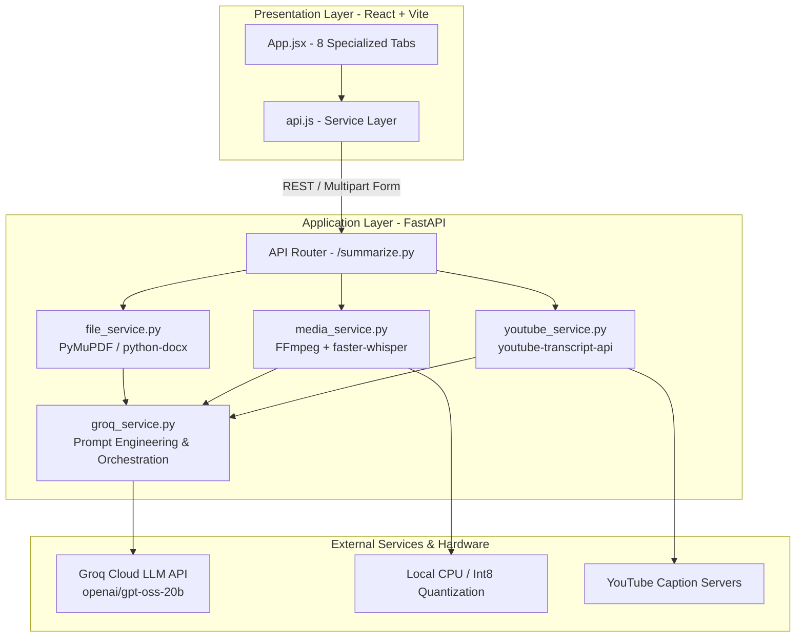
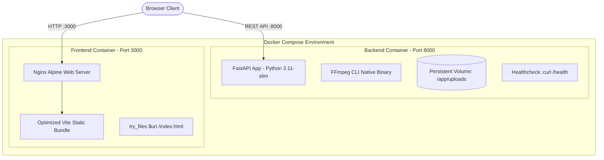

# AI Summarizer — Architecture & Technical Design Document

## 1. Problem Statement
Knowledge workers, analysts, and students process vast quantities of unstructured information across heterogeneous modalities: lengthy PDFs, multi-document briefings, technical podcasts, recorded webinars, and YouTube lectures. Traditional generic summaries often lack format flexibility, fail on large context boundaries, or cannot isolate delta changes across document revisions.

## 2. System Objectives
1. **Multi-Modal Ingestion**: Uniform handling of plain text, PDFs, Microsoft Word (`.docx`), audio files, video files, and YouTube streams.
2. **Context Adaptation**: Dynamic length and format controls (Short / Medium / Long; Paragraph / Bullets / Table) and Executive Summary syntheses.
3. **Complex Document Architectures**:
   - **Comparative Summarization**: Contrast two distinct viewpoints or versions.
   - **Hierarchical Map-Reduce**: Chunk and reduce long-form content beyond typical LLM context windows.
   - **Update / Delta Analysis**: Change-detection comparing previous summaries with incoming source material.
4. **Sub-Second to Low-Latency Inference**: Leveraging Groq's high-speed LPU infrastructure with localized transcription pipelines.

---

## 3. High-Level Architecture

---

## 4. Subsystem Pipelines

### A. Document Parsing Pipeline
- **TXT**: Direct UTF-8 stream decoding.
- **PDF**: Fast in-memory parsing using PyMuPDF (`fitz`) extracting clean text blocks across all document pages.
- **DOCX**: XML traversal through `python-docx` extracting paragraph content.

### B. Audio / Video Transcription Pipeline
1. Uploaded media is validated against allowed file types (`.mp3`, `.wav`, `.m4a`, `.mp4`, `.mkv`, `.webm`, `.avi`, `.flac`, `.ogg`).
2. **Resilience & Lazy Initialization**: The `faster-whisper` model is lazy-loaded on first request, ensuring FastAPI server startup is instantaneous and never blocked by model initialization.
3. **OS Code Integrity & Smart App Control Compatibility**: On Windows environments enforcing Smart App Control (WDAC), unsigned third-party C-extensions (like PyAV `av.audio.codeccontext`) are blocked. The pipeline gracefully detects this and supplies an FFmpeg CLI audio decoding fallback, transforming media directly into 16 kHz mono float32 numpy arrays for `ctranslate2` Whisper.
4. Audio artifacts are unlinked in `finally` blocks to ensure disk hygiene.

### C. YouTube Transcript Extraction
1. Regex parses standard URLs, short links (`youtu.be`), embeds, and YouTube Shorts into an 11-character video ID.
2. `youtube-transcript-api` queries YouTube's automated caption track endpoints with translatable fallback.
3. Subtitle timing and musical bracket artifacts (e.g. `[Music]`) are sanitized into clean, coherent text.

### D. Hierarchical Map-Reduce Engine
1. **Map Step**: A structure-aware chunking algorithm partitions text along headings, chapter markers, and paragraphs into target-sized chunks (500–20,000 chars) with configurable overlap.
2. **Concurrent Chunk Processing**: Section chunks are dispatched concurrently using a bounded `ThreadPoolExecutor(max_workers=4)`, reducing end-to-end processing latency by up to 65% while maintaining strict deterministic section sequence ordering.
3. **Reduce Step**: Section summaries (or intermediate batches for huge documents) are synthesized into a cohesive master overview matching the requested length and format.

---

## 5. Security, Reliability & Deployment Readiness
- **Secret Isolation**: Private Groq API keys are restricted to backend environment variables (`.env`), completely excluded from client-side code and frontend bundles.
- **Configurable CORS Strategy**: Supports explicit CORS origin white-listing via `CORS_ORIGINS` environment configuration while enforcing Starlette compliance for credentialed requests.
- **Storage Lifecycle & Hygiene**: Files are streamed into a standardized `backend/uploads/` directory with byte-level chunk limits (10 MB). Leftover or orphaned temporary files older than 1 hour are automatically pruned on server boot.
- **Frontend Safeguards**: Client-side instant validation flags unsupported extensions and oversized files before transfer begins. Form submit handlers employ `isLoading` guards to guarantee zero duplicate submissions.
- **Defensive Error Handling**: Non-technical HTTP 400/413/422 errors prevent internal stack trace leakage while providing clear remediation guidance.

---

## 6. Containerization & Deployment Strategy

- **Backend Container (`backend/Dockerfile`)**: Built on `python:3.11-slim` with system FFmpeg and curl. Exposes port 8000 and runs Uvicorn. Implements a container-level healthcheck probing `/health`. Mounts persistent storage for `/app/uploads` without introducing unneeded databases or caches.
- **Frontend Container (`frontend/Dockerfile`)**: Multi-stage build (Node 20 Alpine builder -> Nginx Alpine runtime). Accepts `VITE_API_BASE_URL` build argument and serves compressed static assets with SPA fallback (`try_files $uri $uri/ /index.html;`) and security headers.
- **Docker Compose Orchestration (`docker-compose.yml`)**: Single command orchestration (`docker compose up --build`) coordinating backend and frontend over an isolated bridge network (`summarizer-net`).

---

## 7. CI/CD & Automated Quality Pipeline

- **Automated GitHub Actions (`.github/workflows/ci.yml`)**:
  - **Backend Quality Job**: Validates Python 3.11 on `ubuntu-latest`, installs FFmpeg, and executes the 32-test regression suite.
  - **Deterministic CI Mode**: Tests run with mocked LLM provider (`--ci`), eliminating external rate limits, costs, and token exposure in CI runners.
  - **Frontend Quality Job**: Verifies clean production bundling with `npm ci` and `npm run build` under Node.js 20 (0 errors, 0 warnings).
  - **Security Audit Job**: Scans tracked files with `git ls-files` to enforce that zero `.env`, `.pem`, `.key`, or build artifacts enter version control.

---

## 8. Performance, Observability & Connection Pooling

- **Cross-Platform SSL Resilience & Connection Pooling**:
  - `get_groq_client()` leverages a custom `httpx.Client` equipped with `ssl.create_default_context()`.
  - Seamlessly resolves Windows System Root CA certificates as well as standard Linux/Docker CA bundles without external proxy failures.
  - Keeps 10-20 persistent keep-alive connections alive, eliminating repetitive TCP/TLS handshake latency on batch and parallel requests.
- **Request Latency Middleware & Observability**:
  - Every HTTP interaction records high-resolution wall-clock duration (`time.perf_counter()`).
  - Responses automatically attach `X-Process-Time` (e.g. `0.0016s`), offering transparent client-side and APM visibility.
  - Structured logging across `ai_summarizer.http`, `ai_summarizer.media`, and `ai_summarizer.groq` traces execution milestones while guaranteeing zero credential or document content leakage.
