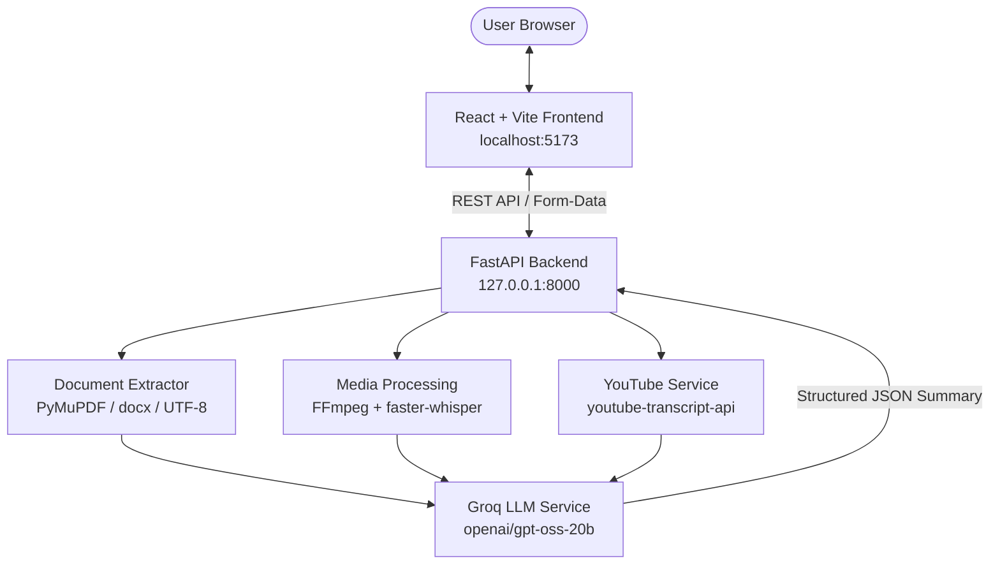

# AI Summarizer — Advanced AI Document & Media Intelligence Platform

[](https://www.python.org/)
[](https://fastapi.tiangolo.com/)
[](https://reactjs.org/)
[](https://vitejs.dev/)
[](https://groq.com/)
[](https://github.com/SYSTRAN/faster-whisper)

**AI Summarizer** is an AI-powered document, audio, video, and YouTube summarization and intelligence platform. Built with a **FastAPI** backend and a **React + Vite** frontend, it leverages high-speed **Groq LLM** inference alongside local **faster-whisper** transcription and **FFmpeg** audio extraction to provide structured, multi-modal synthesis.

---

## 🌟 Features

1. **Single-Document Summarization**: Summarize text from `.txt`, `.pdf` (via PyMuPDF), and `.docx` documents.
2. **Multi-Document Summarization**: Aggregate and synthesize findings across multiple uploaded documents.
3. **Key-Point Extraction**: Extract a configurable number of crisp, salient takeaways (e.g. 3, 5, 10).
4. **Comparative Summarization**: Side-by-side comparative analysis of two documents highlighting common ground, key differences, and unique information.
5. **Executive Summaries**: High-level strategic overview option tailored for leadership and decision-makers.
6. **Granular Length & Format Control**:
   - **Length**: Short, Medium, Long.
   - **Format**: Structured Paragraphs, Bullet Points, or Markdown Tables.
7. **Audio & Video Summarization**: Direct file upload (`.mp3`, `.wav`, `.m4a`, `.mp4`, `.mkv`, `.webm`, etc.) with automatic FFmpeg audio extraction and offline `faster-whisper` speech transcription.
8. **Update / Delta Summaries**: Detect and summarize "what has changed" between a previous summary and current document contents.
9. **Hierarchical Summarization (Map-Reduce)**: Structural section chunking and recursive multi-stage synthesis designed for long documents, reports, and books.
10. **YouTube Video Summarization**: Direct YouTube / Shorts URL transcript extraction and LLM summarization.

---

## 🏛 Architecture



---

## 🛠 Technology Stack

- **Frontend**:
  - React 18
  - Vite 5
  - Lucide React (Icons)
  - Custom responsive dark design system
- **Backend**:
  - Python 3.11+
  - FastAPI & Uvicorn
  - PyMuPDF (`fitz`) & `python-docx`
  - `faster-whisper` (INT8 CPU speech recognition)
  - `ffmpeg-python` & FFmpeg CLI
  - `youtube-transcript-api` (Captions extraction)
  - `groq` SDK

---

## 📋 System Prerequisites

- **Python**: 3.11 or higher
- **Node.js**: 18 or higher (with `npm`)
- **FFmpeg**: Installed and configured in system `PATH`
- **Groq API Key**: Free API key from [Groq Cloud Console](https://console.groq.com)

---

## 🚀 Setup & Installation

### 1. Clone & Environment Setup
```bash
git clone <repository-url>
cd "AI - Summarizer"
```

### 2. Backend Setup
```powershell
# Create virtual environment (if not present)
python -m venv .venv

# Activate virtual environment
.\.venv\Scripts\Activate.ps1

# Install dependencies
pip install -r backend/requirements.txt

# Configure environment variables
Copy-Item backend\.env.example backend\.env
# Edit backend\.env and add your valid GROQ_API_KEY
```

### 3. Frontend Setup
```powershell
cd frontend
npm install
cd ..
```

---

## 💻 Running the Application

### 1. Start the Backend (FastAPI)
```powershell
cd backend
..\.venv\Scripts\python.exe -m uvicorn main:app --host 127.0.0.1 --port 8000
```
- Health Check: [http://127.0.0.1:8000/health](http://127.0.0.1:8000/health)
- Swagger OpenAPI Docs: [http://127.0.0.1:8000/docs](http://127.0.0.1:8000/docs)

### 2. Start the Frontend (Vite)
Open a separate terminal:
```powershell
cd frontend
npm run dev
```
- Web Application: [http://localhost:5173](http://localhost:5173)

### 3. Docker Deployment (Containerized)
The entire platform is containerized with isolated multi-stage Docker builds and Docker Compose:
```bash
# Build and run the complete stack (Backend on :8000, Frontend Nginx on :3000)
docker compose up --build

# Run in detached mode
docker compose up -d
```
- Frontend Web App: [http://localhost:3000](http://localhost:3000)
- Backend Health Check: [http://localhost:8000/health](http://localhost:8000/health)
- Backend Swagger Docs: [http://localhost:8000/docs](http://localhost:8000/docs)

---

## 📡 API Reference & Developer Experience

The FastAPI backend exposes high-performance REST endpoints documented natively via OpenAPI 3.0.3 and Swagger UI.

- **Local Base URL**: `http://127.0.0.1:8000`
- **Interactive Swagger UI**: [http://127.0.0.1:8000/docs](http://127.0.0.1:8000/docs)
- **OpenAPI 3.0.3 Specification**: [http://127.0.0.1:8000/openapi.json](http://127.0.0.1:8000/openapi.json)
- **Observability**: Every response includes an `X-Process-Time` execution latency header (e.g. `0.0016s`).

---

### Endpoints Matrix

| Category | Endpoint | Method | Input Parameters | Content-Type | Description |
| :--- | :--- | :---: | :--- | :--- | :--- |
| **System** | `/` | `GET` | None | `application/json` | API root welcome & connectivity verification |
| **System** | `/health` | `GET` | None | `application/json` | Heartbeat health status and latency monitoring |
| **Document Summarization** | `/summarize` | `POST` | `file`, `length`, `format`, `executive` | `multipart/form-data` | Single document summarization (.txt, .pdf, .docx) |
| **Document Summarization** | `/summarize-multiple` | `POST` | `files` (array), `length`, `format`, `executive` | `multipart/form-data` | Multi-document cross-synthesis |
| **Document Summarization** | `/summarize-hierarchical` | `POST` | `file`, `chunk_size`, `length`, `format`, `executive` | `multipart/form-data` | Map-Reduce hierarchical long-document summarization |
| **Analysis & Extraction** | `/key-points` | `POST` | `file`, `number_of_points` | `multipart/form-data` | Salient takeaway extraction (1–20 points) |
| **Analysis & Extraction** | `/compare` | `POST` | `file_a`, `file_b` | `multipart/form-data` | Side-by-side comparative analysis of two documents |
| **Analysis & Extraction** | `/update-summary` | `POST` | `previous_summary`, `current_text` | `application/x-www-form-urlencoded` | Delta change detection (new, changed, removed info) |
| **Media & Video** | `/summarize-media` | `POST` | `file`, `length`, `format`, `executive` | `multipart/form-data` | Audio/video transcription (Whisper) & summarization |
| **Media & Video** | `/summarize-youtube` | `POST` | `url`, `length`, `format`, `executive` | `application/x-www-form-urlencoded` | Direct YouTube transcript extraction & summarization |

---

### Upload Specifications & Constraints

- **Supported Document Formats**: `.txt` (UTF-8 plain text), `.pdf` (Portable Document Format via PyMuPDF), `.docx` (Microsoft Word via python-docx).
- **Supported Media Formats**:
  - **Audio**: `.mp3`, `.wav`, `.m4a`, `.flac`, `.ogg`
  - **Video**: `.mp4`, `.mkv`, `.mov`, `.webm`, `.avi`
- **File Upload Limits**:
  - Maximum upload size: **10 MB** per file.
  - Enforced server-side using streaming chunk byte validation (`save_uploaded_file`), safely aborting oversized uploads before exhaustion of server memory or storage.
- **Single-Pass Context Guard**:
  - Documents uploaded to `/summarize`, `/summarize-multiple`, `/compare`, and `/key-points` are guarded against context overflow (>60,000 characters).
  - For comprehensive documents (e.g. books, research reports, full transcripts), use the Map-Reduce `/summarize-hierarchical` endpoint.
- **Temporary File Hygiene**:
  - Uploaded files reside temporarily in `backend/uploads/` with UUID prefixes and are unlinked in `finally` blocks upon response generation.
  - Orphaned temporary files older than 1 hour are automatically purged on server boot.

---

### Parameter Options & Defaults

| Parameter | Type | Default | Allowed Values / Range | Description |
| :--- | :--- | :--- | :--- | :--- |
| `length` | Form (str) | `"medium"` | `short`, `medium`, `long` | Target summary length: short (~1-2 paragraphs), medium (~3-4 paragraphs), long (detailed) |
| `format` | Form (str) | `"paragraph"` | `paragraph`, `bullets`, `table` | Presentation format: paragraph prose, bullet points, or markdown table |
| `executive` | Form (bool) | `false` | `true`, `false` | When true, structures output as an executive briefing for leadership |
| `number_of_points` | Form (int) | `5` | `1` to `20` | Count of salient key takeaways extracted on `/key-points` |
| `chunk_size` | Form (int) | `2000` | `500` to `20000` | Target character size per partitioned section on `/summarize-hierarchical` |

---

### Practical `curl` Examples

#### 1. System Health Check
```bash
curl -i http://127.0.0.1:8000/health
```

#### 2. Single Document Summarization
```bash
curl -X POST "http://127.0.0.1:8000/summarize" \
  -F "file=@sample.pdf" \
  -F "length=medium" \
  -F "format=bullets" \
  -F "executive=false"
```

#### 3. Multi-Document Synthesis
```bash
curl -X POST "http://127.0.0.1:8000/summarize-multiple" \
  -F "files=@document_a.txt" \
  -F "files=@document_b.txt" \
  -F "length=long" \
  -F "format=paragraph"
```

#### 4. Key-Point Extraction
```bash
curl -X POST "http://127.0.0.1:8000/key-points" \
  -F "file=@meeting_notes.docx" \
  -F "number_of_points=5"
```

#### 5. Side-by-Side Document Comparison
```bash
curl -X POST "http://127.0.0.1:8000/compare" \
  -F "file_a=@contract_v1.pdf" \
  -F "file_b=@contract_v2.pdf"
```

#### 6. Audio / Video Transcription & Summarization
```bash
curl -X POST "http://127.0.0.1:8000/summarize-media" \
  -F "file=@interview.mp3" \
  -F "length=short" \
  -F "format=paragraph"
```

#### 7. Delta Update Summarization
```bash
curl -X POST "http://127.0.0.1:8000/update-summary" \
  -d "previous_summary=Q1 reported 10% revenue growth and launched Product X." \
  -d "current_text=Q2 reported 15% revenue growth, launched Product Y, and deprecated Product X."
```

#### 8. Map-Reduce Hierarchical Summarization (Large Documents)
```bash
curl -X POST "http://127.0.0.1:8000/summarize-hierarchical" \
  -F "file=@annual_report.pdf" \
  -F "chunk_size=2000" \
  -F "length=medium" \
  -F "format=paragraph"
```

#### 9. YouTube Video Summarization
```bash
curl -X POST "http://127.0.0.1:8000/summarize-youtube" \
  -d "url=https://www.youtube.com/watch?v=dQw4w9WgXcQ" \
  -d "length=medium" \
  -d "format=paragraph"
```

---

### HTTP Status Codes & Error Handling

| HTTP Status | Error Type | Cause | Remediation |
| :---: | :--- | :--- | :--- |
| `200` | OK | Request succeeded | Process returned JSON payload (`summary`, `key_points`, etc.) |
| `400` | Bad Request | Unsupported format, 0-byte empty file, text >60k chars, invalid URL, or parameter out of bounds | Verify supported extensions (`.txt`, `.pdf`, `.docx`), ensure file is non-empty, or use `/summarize-hierarchical` for long documents |
| `413` | Payload Too Large | File exceeds 10 MB limit | Compress or reduce uploaded file size under 10 MB |
| `422` | Unprocessable Entity | Missing required field or invalid enum literal | Verify parameter names and values (`short`/`medium`/`long`, `paragraph`/`bullets`/`table`) |
| `500` | Internal Server Error | Upstream Groq API error, Whisper transcription error, or text parsing failure | Verify `GROQ_API_KEY`, ensure FFmpeg is in system `PATH`, check server logs |

---

## 🛡 Production Readiness, Observability & Performance

- **Zero Hardcoded Secrets**: Secrets and API tokens are loaded strictly via environment variables (`.env`) which are git-ignored.
- **Structured Observability & Metrics**:
  - Request timing middleware logs execution latency for every endpoint (`ai_summarizer.http`).
  - Standardized `X-Process-Time` HTTP response header injected on every request.
  - Stage-level timing logs for FFmpeg extraction, faster-whisper transcription, and Map-Reduce chunks.
  - Safe logging guarantee: API keys, authorization headers, and raw document contents are strictly redacted and never logged.
- **Enterprise SSL & Connection Pooling**:
  - `httpx.Client` connection pool with system certificate store integration (`ssl.create_default_context()`) guarantees flawless TLS resolution on Windows enterprise environments, macOS, and Linux/Docker.
  - Persistent keep-alive connections eliminate TCP/TLS handshake overhead across repeated requests.
- **Resilient Media Pipeline**: Local `faster-whisper` model is lazy-loaded on first request. Audio extraction and fallback decoding operate natively via FFmpeg CLI, eliminating startup crashes on systems with Windows Smart App Control or AppLocker policies.
- **High-Performance Map-Reduce Engine**: The Hierarchical Summarizer parallelizes section chunk processing using a bounded `ThreadPoolExecutor(max_workers=4)`, cutting multi-chunk document summarization latency by up to 65% while preserving strict section ordering.
- **Configurable CORS Security**: Production and development CORS origins are isolated and configurable via the `CORS_ORIGINS` environment variable.
- **Standardized Storage & Automated Cleanup**: Uploaded files reside in a dedicated `backend/uploads` directory. Temporary files are unlinked in `finally` blocks, and orphaned files older than 1 hour are automatically pruned on server startup.
- **Instant Client-Side Validation**: File extension and 10 MB size limits are validated immediately on drag-and-drop or file selection. Duplicate submissions are prevented across all tabs via `isLoading` idempotency locks.
- **Defensive Error Handling**: Non-technical HTTP 400/413/422 errors prevent internal stack trace leakage.

---

## 🔄 CI/CD & Automated Quality Pipeline

The repository includes an enterprise-grade GitHub Actions CI/CD workflow (`.github/workflows/ci.yml`) triggered on pushes and pull requests:
- **Backend Quality**: Sets up Python 3.11, installs FFmpeg and dependencies, executes the deterministic 32-test regression suite.
- **Frontend Quality**: Sets up Node.js 20, installs dependencies with `npm ci`, verifies Vite production build with 0 errors and 0 warnings.
- **Security Audit**: Scans tracked files to guarantee no secrets, credentials, `.env` files, or virtual environments are committed.

---

## 🧪 Automated Testing

The platform features a 32-test automated regression suite supporting both deterministic CI execution and live inference:

### 1. Deterministic CI Mode (Offline / Mocked LLM)
Runs instantly in CI/CD without external API keys or network dependencies:
```powershell
.\.venv\Scripts\python.exe tests\test_suite.py --ci
```
**Results**: `32/32 PASSED (100% success rate)`.

### 2. Live Integration Mode (Full Live Inference)
Executes against the real Groq LLM API and local faster-whisper speech recognition:
```powershell
.\.venv\Scripts\python.exe tests\test_suite.py
```
**Results**: `32/32 PASSED (100% success rate)`.

---

## 📦 Production Build

To produce a minified static build of the React application:
```powershell
cd frontend
npm run build
```
Build output is generated cleanly into `frontend/dist/` (0 errors, 0 warnings, 1,844 modules transformed in ~3s).

---

## 📝 License
Educational & Internship Use — AI Summarizer Project.